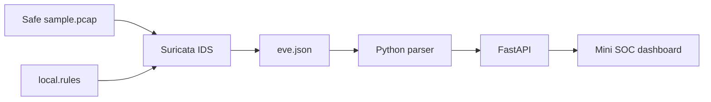

# NetSentinel

A defensive Network Intrusion Detection and Incident Response Platform for
SOC and Blue-Team learning.

> **Part 1 status:** Suricata offline PCAP analysis, a safe custom detection
> rule, EVE JSON parsing, FastAPI endpoints, tests, Docker Compose, and a small
> analyst dashboard.

## Safety and authorization

Use NetSentinel only with traffic you own or have explicit permission to
monitor. Part 1 deliberately analyzes an included harmless PCAP in an isolated
container with no network access. Never commit real company traffic, personal
data, credentials, private keys, or sensitive packet captures.

## Architecture



## Included features

- Suricata 8.0.6 running in offline PCAP mode
- Harmless custom HTTP detection rule
- Safe sample PCAP created specifically for this repository
- EVE JSON alert parser
- `GET /health`
- `GET /api/v1/alerts`
- Severity filtering and result limits
- Swagger documentation
- Responsive mini SOC dashboard
- Parser and API tests
- Docker security hardening for the API
- Windows PowerShell helper scripts

## Folder structure

```text
netsentinel/
├── backend/
│   ├── app/
│   │   ├── api/
│   │   ├── core/
│   │   ├── services/
│   │   ├── web/
│   │   ├── main.py
│   │   └── models.py
│   ├── tests/
│   ├── Dockerfile
│   └── requirements.txt
├── data/
│   ├── logs/
│   └── pcap/sample.pcap
├── docs/architecture.md
├── rules/local.rules
├── scripts/
├── docker-compose.yml
└── README.md
```

## Requirements

Install these on your Windows laptop:

1. GitHub Desktop
2. Docker Desktop
3. Docker Desktop's WSL 2 backend
4. PowerShell, which is already included with Windows

Keep Docker Desktop open while running the commands.

## First run on Windows

Open the cloned `netsentinel` folder in File Explorer. Click the address bar,
type `powershell`, and press Enter.

### 1. Create your local environment file

```powershell
Copy-Item .env.example .env
```

### 2. Analyze the included safe PCAP

```powershell
powershell -ExecutionPolicy Bypass -File .\scripts\analyze.ps1
```

This creates:

```text
data/logs/eve.json
```

### 3. Start the API and dashboard

```powershell
powershell -ExecutionPolicy Bypass -File .\scripts\start.ps1
```

Open:

- Dashboard: `http://localhost:8000`
- Swagger docs: `http://localhost:8000/docs`
- Health: `http://localhost:8000/health`
- Alerts: `http://localhost:8000/api/v1/alerts`

You should see an alert named:

```text
NETSENTINEL Safe Test HTTP Request
```

### 4. Filter alerts

```text
http://localhost:8000/api/v1/alerts?severity=low&limit=10
```

Suricata severity uses `1` as high, `2` as medium, and `3` as low. The included
laboratory rule is intentionally low severity.

### 5. Run tests

```powershell
docker compose run --rm api pytest -q
```

### 6. Stop NetSentinel

```powershell
powershell -ExecutionPolicy Bypass -File .\scripts\stop.ps1
```

## Manual Docker commands

The helper scripts above run these commands:

```powershell
docker compose --profile tools run --rm suricata
docker compose up --build -d api
docker compose logs -f api
docker compose down
```

## API example

Example alert response:

```json
{
  "source": "/data/logs/eve.json",
  "source_exists": true,
  "count": 1,
  "malformed_lines": 0,
  "items": [
    {
      "timestamp": "2026-08-07T10:00:00.000000+1000",
      "src_ip": "192.168.56.10",
      "src_port": 49152,
      "dest_ip": "192.168.56.20",
      "dest_port": 80,
      "signature_id": 1000001,
      "signature": "NETSENTINEL Safe Test HTTP Request",
      "severity_label": "low"
    }
  ]
}
```

## GitHub upload

After the project works:

1. Open GitHub Desktop.
2. Confirm the current repository is `netsentinel`.
3. Review the changed files.
4. Summary:

```text
feat: build NetSentinel Part 1 IDS foundation
```

5. Click **Commit to main**.
6. Click **Push origin**.

Do not upload `.env` or generated files from `data/logs`. The `.gitignore`
already excludes them.

## Part 1 learning outcomes

By completing this milestone you can explain:

- How offline PCAP analysis differs from live capture
- How a Suricata rule creates an alert
- Why EVE uses newline-delimited JSON
- How an API safely reads IDS output
- How Docker volumes connect a sensor and an API
- Why sensitive PCAP and logs must not be committed

## Next milestone

Part 2 will add PostgreSQL, persistent alert ingestion, pagination, search,
deduplication, and incident-ready database models.

## License

MIT
