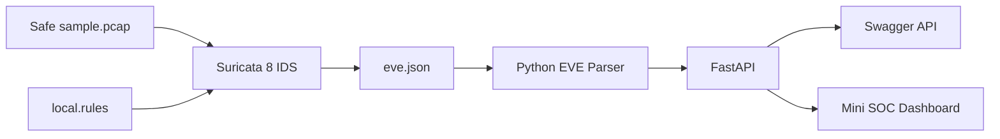

# NetSentinel Part 1 Architecture

## Trust boundaries

1. The Suricata container has no network interface because it uses
   `network_mode: none`.
2. Only the included safe PCAP is analyzed.
3. Generated logs are not committed to Git.
4. The API mounts the log directory as read-only.
5. The API container runs with a read-only filesystem and
   `no-new-privileges`.
